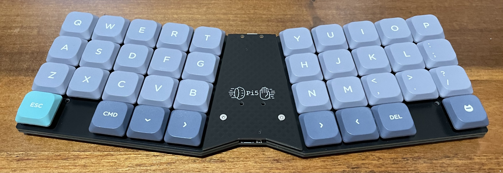

# Pi5 Keyboard

A monoblock split 38-key keybaord inspired by the [ChocV](https://github.com/brickbots/chocV).

## Design

The board consists of two boards, the main PCB and a mounting plate. The switches are on a 19x19mm spacing with the footprint supporting Kailh Choc V1, V2, Gateron low profile, and MX switches.

The bottom of the board features footprints for a convenient reset switch and a JST connector with 3.3v and I2C data that (again, untested) should support [Qwiic](https://www.sparkfun.com/qwiic) or [STEMMA QT](https://learn.adafruit.com/introducing-adafruit-stemma-qt/what-is-stemma-qt) accessories.

The spacing between the PCB and plate with V2 Choc switches doesn't allow for SMD parts. Fortunately the diode footprint also allows though-hole components so they can be soldered under the PCB.

## Build one!

Check out the [gerbers folder](Gerbers/) for zip files that can be uploaded to your PCB manufacturer of your choice.
